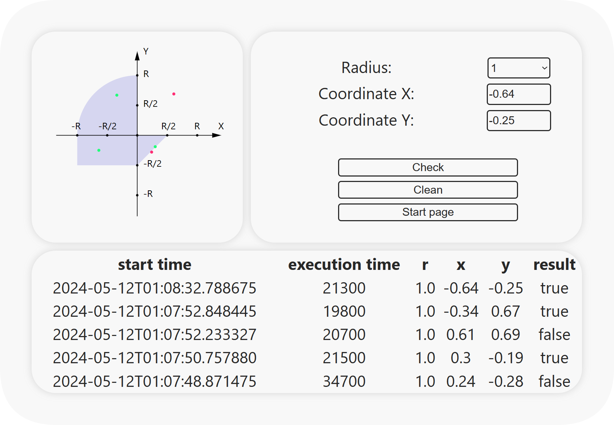

# Лабораторная работа №3

Приложение, осуществляющее проверку попадания точки в заданную область на координатной плоскости

- Приложение разработано на базе __Java Server Faces Framework__
- Результаты проверки попаданий сохраняются в базе данных под управлением СУБД __PostgreSQL__
- Для доступа к БД используется ORM __Hibernate__

## Интерфейс основной страницы

#### Диапазоны изменения данных

- X: (-3; 5)

- Y: (-4; 4)

- R: {1, 2, 3, 4 5}
