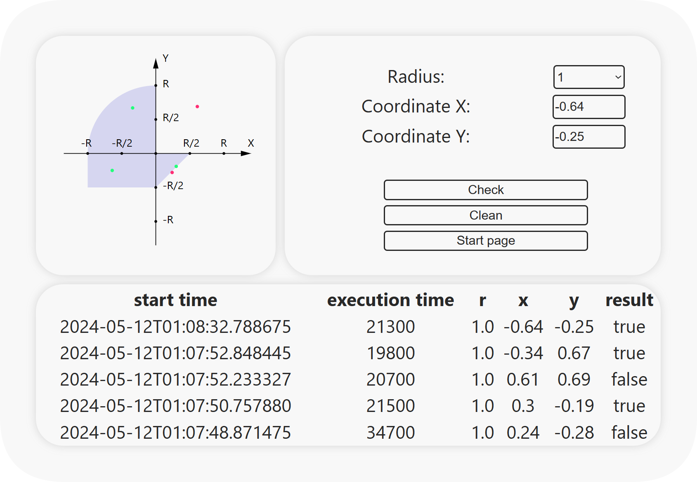

# Лабораторная работа №3

Приложение, осуществляющее проверку попадания точки в заданную область на координатной плоскости

- Java Server Faces
- PostgreSQL
- Hibernate

__Интерфейс основной страницы__

__Диапазоны изменения данных__
- X: (-3; 5)
- Y: (-4; 4)
- R: {1, 2, 3, 4 5}

